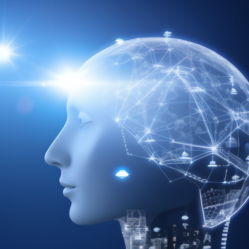

    
    <h1>The Future of Artificial Intelligence: A Look at What's to Come</h1>

***

    <h3 class='blog-author'>Sarah Lee</h3>
    <h3 class='blog-date'>Published October 15, 2022</h3>

As we move further into the digital age, it's becoming clear that artificial intelligence (AI) is going to play an increasingly important role in shaping our world. From self-driving cars to virtual assistants, AI is already transforming the way we live and work. But what does the future hold for this powerful technology?

## Advancements in AI

One thing that's certain is that AI is only going to become more intelligent. Thanks to advancements in machine learning and natural language processing, AI is already able to perform tasks that were once thought to be the exclusive domain of humans. And as researchers continue to refine these technologies, we can expect to see even more impressive feats from AI in the years to come.

## Ethical Implications of AI

But with great power comes great responsibility, and it's important that we consider the ethical implications of this rapidly advancing technology. Already, there are concerns about the potential for AI to automate jobs and exacerbate inequality. And as AI becomes more sophisticated, there's a risk that it could be used to perpetrate crimes or perpetuate biases.

## The Positive Impact of AI

Despite these challenges, there's no doubt that AI has the potential to be a force for good in our world. In healthcare, for example, AI could be used to analyze large amounts of medical data and identify patterns that could lead to breakthroughs in treatment. And in education, AI could be used to provide personalized learning experiences that adapt to the needs of individual students.

## Conclusion

Overall, the future of AI is exciting and full of possibilities. As long as we approach this technology with a thoughtful and responsible mindset, we can ensure that it has a positive impact on our world for generations to come.